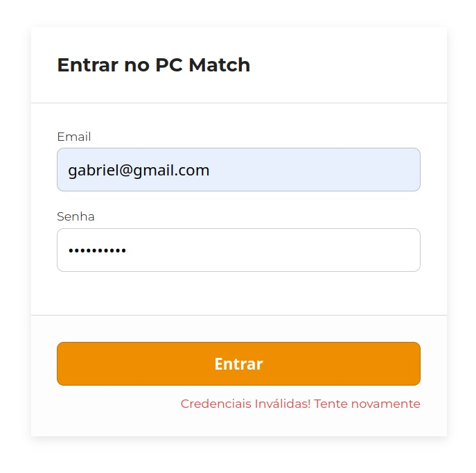
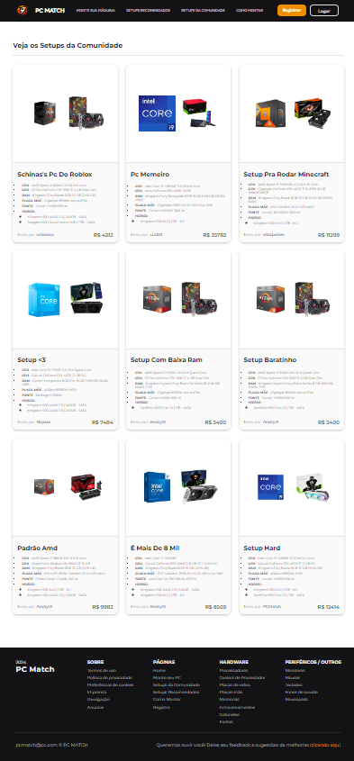

# Informações do Projeto
`TÍTULO DO PROJETO`  

**PC Match**

`CURSO` 

**Análise e Desenvolvimento de Sistemas & Sistemas de Informação**

## Participantes

Os membros do grupo são:

- Abner Augusto Monteiro
- Andry Marques Pereira da Silveira
- Isaac Souza Fernandes
- João Paulo Oliveira Serra
- Luiz Fernando Versiani de Melo Penna
- Samuel Andrade Neto

# Estrutura do Documento

- [Informações do Projeto](#informações-do-projeto)
  - [Participantes](#participantes)
- [Estrutura do Documento](#estrutura-do-documento)
- [Introdução](#introdução)
  - [Problema](#problema)
  - [Objetivos](#objetivos)
  - [Justificativa](#justificativa)
  - [Público-Alvo](#público-alvo)
- [Especificações do Projeto](#especificações-do-projeto)
  - [Personas e Mapas de Empatia](#personas-e-mapas-de-empatia)
  - [Histórias de Usuários](#histórias-de-usuários)
  - [Requisitos](#requisitos)
    - [Requisitos Funcionais](#requisitos-funcionais)
    - [Requisitos não Funcionais](#requisitos-não-funcionais)
  - [Restrições](#restrições)
- [Projeto de Interface](#projeto-de-interface)
  - [User Flow](#user-flow)
  - [Wireframes](#wireframes)
- [Metodologia](#metodologia)
  - [Divisão de Papéis](#divisão-de-papéis)
  - [Ferramentas](#ferramentas)
  - [Controle de Versão](#controle-de-versão)
- [Projeto da Solução](#projeto-da-solução)
  - [Tecnologias Utilizadas](#tecnologias-utilizadas)
  - [Arquitetura da solução](#arquitetura-da-solução)
- [Avaliação da Aplicação](#avaliação-da-aplicação)
  - [Plano de Testes](#plano-de-testes)
  - [Registros de Testes](#registros-de-testes)
- [Referências](#referências)

&nbsp;

# Introdução

No mundo contemporâneo, com os avanços e popularização de novas tecnologias cada vez mais modernas, a crescente acessibilidade de aquisição de computadores de uso pessoal, chamados _desktop_, possibilitou o uso dessas máquinas em espaços cada vez mais diversificados, abrangendo situações no âmbito profissional e pessoal.

Com isso em mente, o projeto PC Match tem como objetivo solucionar os problemas comuns às pessoas que desejam adquirir um novo computador de uso pessoal, como a falta de informação de utilidade das peças e compatibilidade, por exemplo. Esses problemas se intensificam especialmente quando o _hardware_, ou parte física do computador, deve atender um uso direcionado, como é o caso do público _gamer_, que precisam de peças com qualificações específicas para atender os níveis de processamento e renderização que uma aplicação tão complexa como um jogo exige para entregar a experiência para o usuário de maneira apropriada e sem preocupações.

Através de uma plataforma que explica e disponibiliza a opção de montar uma máquina e testar a compatibilidade de diferentes componentes, permitindo que o usuário saiba quais são as peças compatíveis com a sua necessidade específica.

## Problema

Conforme exposto, o problema que o projeto visa resolver é a dificuldade que as pessoas encontram quando precisam montar uma máquina pessoal para jogos ou aplicações que exigem um direcionamento específico de hardware, como a falta de informação sobre o papel a se desempenhar por cada parte do micro, a qualidade de desempenho e a compatibilidade com cada componente do microcomputador.

## Objetivos

O projeto tem como objetivo geral a criação de uma plataforma de compatibilidade de componentes, de uso dinâmico e facilitador, que permita o usuário a elaborar uma máquina completamente personalizada que atenda às suas necessidades como jogador.

## Justificativa

Montar um computador, pode ser complicado para pessoas que não tem conhecimento comum sobre a área, ou que não possuem experiência em hardware ou software, e que, às vezes, só necessitam de um desktop para jogar, estudar, ou trabalhar, de forma simples e prática, dentre outras funcionalidades. 

Quanto à compatibilidade de hardware, que é o nosso foco, em grupo de pessoas que querem montar um computador para jogar, podem encontrar problemas quanto escolher as peças necessárias e, dentre elas, causar a compatibilidade correta, e portanto, funcional para o bom funcionamento da sua máquina. Por exemplo, a placa mãe precisa ser conivente com o processador, a memória RAM, e a placa de vídeo, ou também, a fonte precisa ser adequada para suportar demais funcionalidades, dentre outros aspectos que vão ser decorridos e explicados durante a apresentação desta sprint.

## Público-Alvo

Embora vários grupos de pessoas precisem de computador para vários assuntos, este trabalho foi focado para as pessoas que, independente da idade, necessitam de uma máquina para jogar, desde o jogo com software mais pesado, ao mais leve, que, de modo geral, influencia na escolha do hardware adequado para um bom funcionamento.

Dentro deste grupo, inclui pessoas, como dito anteriormente, de várias idades, e também que querem determinada fluidez e qualidade gráfica, visando ou não, o seu custo benefício, em que se inclui, consequentemente, do mínimo necessário de determinados hardwares, para a sua potência por sequência dos jogos.   

 
# Especificações do Projeto

A partir da entrevista pessoal dos usuários, composta por seis blocos de perguntas direcionadas ao tema, os membros deste projeto consolidaram a definição do problema principal. Além disso, por meio da comparação e observação baseada nas respostas dos usuários, surgiram curiosidades e pontos interessantes a serem tratados neste trabalho. Para atingir tais objetivos foi utilizado personas e histórias de usuários como ferramentas para entender as necessidades, motivações, comportamentos e objetivos dos usuários finais. 

## Personas e Mapas de Empatia

**Personas**

As personas levantadas durante o processo de entendimento do problema são apresentadas nas figuras que se seguem.
 
|**Laís Alves**|
|--------------|
||
**Idade**: 17 anos
**Ocupação**: Estudante. Terminando o 3° Ano do Ensino Médio.
**Estado Civil**: Solteira.
**Aplicativos usados**: TikTok, Youtube, Instagram, Tinder, Spotify e X (Twitter).
**Motivações**: Socialização, entretenimento, curiosidades e amizades.
**Frustrações**: Preços altos, travamentos, falta de conhecimento e insegurança.
**Hobbies**: Assistir TikTok, Tinder, se maquiar e correr na rua.|

&nbsp;

|**Fernando Souza**|
|--------------|
||
**Idade**: 27 anos
**Ocupação**: CMO (Chief Marketing Officer);
**Estado Civil**: Solteiro.
**Aplicativos usados**: TikTok, Youtube, Instagram, Hotmart, Facebook Ads, Google Ads, WhatsApp, Steam, Epic Games e Netflix.
**Motivações**: Sucesso financeiro, desenvolvimento pessoal e namoro.
**Frustrações**: Pressão do trabalho, adaptações forçadas, constantes e rápidas.
**Hobbies**: Assistir Netflix, sair com a namorada e jogar video game.

&nbsp;

|**Miguel Santos**|
|--------------|
||
**Idade**: 18 anos
**Ocupação**: Estudante. Iniciando a Faculdade.
**Estado Civil**: Solteiro.
**Aplicativos usados**: Youtube, Instagram, WhatsApp, Spotify e Twitch.
**Motivações**: Novas tecnologias, amizades e privacidade.
**Frustrações**: Falta de conhecimento, incertezas sobre o futuro, não ter uma renda mensal, sem autonomia.
**Hobbies**: Tocar teclado, assistir séries, fazer musculação e jogar com os amigos.

&nbsp;

|**Jorge de Almeida**|
|--------------|
||
**Idade**: 35 anos
**Ocupação**: Professor de Física.
**Estado Civil**: Casado.
**Aplicativos usados**: Youtube, Instagram, WhatsApp, Spotify e PlayStation Plus.
**Motivações**: Felicidade dos filhos, estabilidade financeira e esposa.
**Frustrações**: Preocupação com a saúde física.
**Hobbies**: Jogar video game, escutar música clássica e caminhar com a família.

## Histórias de Usuários

Com base na análise das personas forma identificadas as seguintes histórias de usuários:

|EU COMO... `PERSONA`| QUERO/PRECISO ... `FUNCIONALIDADE` |PARA ... `MOTIVO/VALOR`                 |
|--------------------|------------------------------------|----------------------------------------|
|Laís Alves          | Montar um computador               | Para acessar as redes sociais, ver vídeos e principalmente jogar com as amigas |
|Fernando Souza      | Comprar um computador pronto       | Necessidade para o trabalho e relaxar jogando nas horas vagas |
|Miguel Santos       | Entender o funcionamento das peças de um computador para poder montar o seu focado em jogos | Realizar as tarefas da faculdade, curtir alguns jogos com os amigos, acompanhar lives e vídeos. |
|Jorge  de Almeida   | Gostaria de um aplicativo que ensinasse sobre as melhores peças de computador para jogar. | Presentear os filhos que gostam de jogar com um computador gamer |
|Jorge de Almeida    | Adquirir um computador seja capaz de lidar com os jogos mais recentes e exigentes, e que dure por muitos anos | Para experimentar jogos com experiência imersiva, onde possa escapar da rotina diária. |

Um pouco sobre Laís Alves

Laís é uma jovem extrovertida e socialmente ativa, que gosta de se conectar com amigos e compartilhar experiências online. Ela é uma usuária ávida do aplicativo TikTok, onde passa uma quantidade significativa de tempo assistindo a vídeos engraçados, tutoriais de beleza e danças virais. Laís também está interessada em moda, maquiagem e cultura pop, e segue influenciadores e criadores de conteúdo que compartilham seu estilo de vida. Dentre os vídeos que visualizou, alguns são gameplays, cujo youtubers famosos se divertem, o que fez se interessar pelo mundo dos jogos.

Surgiu daí o seu interesse pelos videogames, um tipo de entretenimento que pode servir como uma forma de escapismo, permitindo que Laís se desconecte das pressões e preocupações do dia-a-dia. Os jogos oferecem um ambiente virtual onde ela pode relaxar, se divertir e se envolver em atividades desafiadoras e gratificantes com os amigos. 
Como estudante do último ano do Ensino Médio, Laís enfrenta pressão acadêmica.
Ela também lida com a pressão social de seus colegas e a expectativa de alcançar sucesso acadêmico, ao mesmo tempo em que mantém uma presença ativa nas redes sociais. Deseja comprar um computador mas não sabe nem por onde começar. 

Um pouco sobre Fernando Souza

Fernando tem 27 anos de idade e está a 9 anos no mercado do marketing digital. É apaixonado por tecnologia, e está sempre buscando maneiras de inovar e se destacar no campo.
Ele é um líder motivador e visionário, que inspira sua equipe a alcançar resultados excepcionais por meio de criatividade, colaboração e estratégia.
Fernando é ávido por conhecimento e está constantemente se atualizando sobre as últimas tendências e melhores práticas em marketing digital.
Além disso, Fernando pode enfrentar pressões e expectativas elevadas da alta administração para produzir resultados tangíveis e demonstrar o ROI (retorno sobre o investimento) das iniciativas de marketing digital da empresa.
Ele valoriza o suporte e a colaboração de colegas e líderes da indústria, bem como o acesso a redes profissionais e eventos de networking onde possa compartilhar conhecimentos, trocar ideias e aprender com os outros.
Seu dia a dia é focado no trabalho, por isso não dispensa um bom computador. Em seus finais de semana busca relaxar, por isso pretende adquirir um computador para jogar, mas não tem tempo nem deseja entender como montar um.

Um pouco sobre Miguel Santos

Miguel é um jovem entusiasta de tecnologia e jogos, que adora passar tempo com seus amigos jogando videogames online.
Ele é curioso e gosta de aprender sobre computadores e hardware, e está animado para montar seu próprio computador para jogos.
Além dos jogos, Miguel também está interessado em música, filmes e esportes.
Miguel pode enfrentar o desafio de encontrar o equilíbrio certo entre suas obrigações acadêmicas e sua vida social, especialmente enquanto navega pela transição para a vida universitária.
Ele também pode ter preocupações sobre o custo e a complexidade de montar seu próprio computador, bem como garantir que ele faça as escolhas certas de hardware para atender às suas necessidades de jogo e orçamento.

Um pouco sobre Jorge de Almeida

Jorge é um professor apaixonado por física, que dedica grande parte de seu tempo ao ensino e à educação de seus alunos.
Nos momentos de lazer, Jorge gosta de relaxar jogando videogames. Ele é um entusiasta de longa data dos jogos e cresceu jogando clássicos dos anos 80 e 90.
Como pai de família, Jorge valoriza o tempo de qualidade com sua esposa e filhos, mas também aprecia os momentos de lazer para se divertir e recarregar as energias.
Ele procura jogos que ofereçam uma experiência imersiva e envolvente, onde possa escapar da rotina diária e se aventurar em mundos virtuais emocionantes.
Além disso, Jorge valoriza jogos que possam ser facilmente integrados à sua agenda ocupada, permitindo que ele jogue em sessões curtas durante seus momentos de folga.
Jorge precisa de orientação e recursos que o ajudem a escolher as peças certas para montar o computador de seus filhos, levando em consideração suas necessidades de jogo, idade e nível de habilidade.
Ele valoriza a qualidade e a durabilidade das peças, procurando garantir que o computador seja capaz de lidar com os jogos mais recentes e exigentes, e que dure por muitos anos.
Além disso, Jorge pode se beneficiar de recursos educacionais que o ajudem a ensinar seus filhos sobre tecnologia e hardware de computador, preparando-os para um futuro cada vez mais digital.

## Requisitos

Os requisitos e restrições são partes fundamentais para a elaboração do projeto, explicitando as ideias de modo claro e objetivo para a equipe, organizando a prioridade de cada requisito sendo elas alta, média e baixa. Os requisitos são divididos em duas partes, os funcionais e não funcionais, já as restrições é composta por ela mesma e são apenas as limitações que o projeto deve ter.

### Requisitos Funcionais

Requisitos que determinam as possíveis interação do usuário com o sistema, a tabela a seguir demonstra os requisitos do nosso projeto e o grau de prioridade para cada um.

|ID    | Descrição do Requisito  | Prioridade |
|------|-----------------------------------------|----|
|RF.01| O site deve testar compatibilidade de peças de acordo com a escolha do usuário na montagem do pc. | ALTA | 
|RF.02| O site deve conter uma página home com direcionamento claro para o usuário de o que ele quer fazer. | ALTA |
|RF.03| O site deve conter 4 páginas principais sendo elas home, monte seu pc, setup recomendados e como montar um pc. | MÉDIA | 
|RF.04| O site deve oferecer alguns setups predefinidos para cada tipo de jogador. | MÉDIA |
|RF.05| O site deve fornecer uma página explicativa sobre cada componente do pc e de maneira didática explicando como montá-lo, incluindo vídeos para um melhor entendimento. | MÉDIA | 
|RF.06| O site deve conter média de preço de cada componente  | BAIXA |
|RF.07| O site deve mostrar informações técnicas de cada componente selecionado na área de montagem de pc. | BAIXA | 
|RF.08| O site deve permitir a comparação de componentes de mesma funcionalidade mas de marcas ou gerações diferentes. | BAIXA |
|RF.09| O site deve permitir o salvamento de pcs montados virtualmente no site por usuários. | BAIXA | 
|RF.10| O site deve ter um sistema de avaliação interna de diversos componentes. | BIAXA |

### Requisitos não Funcionais

Requisitos que determinam as especificações gerais do sistema, a tabela a seguir demonstra os requisitos não funcionais do nosso projeto e o grau de prioridade para cada um.

|ID     | Descrição do Requisito  |Prioridade |
|-------|-------------------------|----|
|RnF.01| O site deve ser publicado em um ambiente acessível publicamente na Internet (Repl.it, GitHub Pages, Heroku);  | ALTA | 
|RnF.02| O site deverá ser responsivo permitindo a visualização em qualquer plataforma de forma adequada. | ALTA | 
|RnF.03| O site deve ter coerência entre informações de componentes. | ALTA | 
|RnF.04| O site deve ser compatível com os principais navegadores do mercado (Google Chrome, Firefox, Microsoft Edge). | ALTA | 
|RnF.05| O site deve fornecer dados de preços compatíveis com os preços no atual mercado. | MÉDIA | 
|RnF.06| O site deve permitir o login de cada usuário (que quiser) tendo assim um salvamento de dados seguro. | ALTA | 
|RnF.07| O site deve ter uma estabilidade de conexão. | MÉDIA | 
|RnF.08| O site deve conter um somatório de média de preços do componentes de maneira compatível com o mercado. | MÉDIA | 

## Restrições

Restrições como o próprio nome diz marca a delimitação de campo do no projeto, deixando de maneira objetiva e clara as obrigações para o desenvolvimento, na tabela a seguir demonstra as restrições do nosso projeto.

|ID| Restrição                                             |
|--|-------------------------------------------------------|
|RE.01| O projeto deverá ser entregue no final do semestre, até a data de 30/06/2024. |
|RE.02| O aplicativo deve ser feito com o conhecimento básico da matéria de Desenvolvimento Interface WEB (DIW), podendo usar apenas WEB no Frontend.        |
|RE.03| Apenas os integrantes da equipe podem desenvolver o projeto, sendo assim não permitindo passar a ninguém além da equipe afazeres do projeto.       |

&nbsp; 

# Projeto de Interface

Na elaboração da interface do sistema, estamos priorizando elementos cruciais como acessibilidade, eficiência e facilidade na navegação entre páginas. Nosso objetivo é garantir uma experiência completa e intuitiva para os usuários.

Para alcançar esse objetivo, estamos desenvolvendo uma identidade visual simples e unificada que será aplicada em todas as páginas. Isso significa que os usuários irão encontrar uma interface eficiente e familiar em cada etapa de sua interação com o sistema.

## User Flow

O Fluxo do Usuário irá ser primariamente feito utilizando um cabeçalho presente em todas as páginas. Ele contém o link de acesso para todas as outras páginas da aplicação.

Cada página está devidamente detalhada no Figma, o qual pode ser acessado clicando [neste link (Link do Figma)](https://www.figma.com/file/Xql8McGAjdJcrYDj9NYZ1A/Compatibilidade-de-Pe%C3%A7as-para-PC---Wireframe?type=design&node-id=0%3A1&mode=design&t=l6GPea7nrdTdGoXU-1).

  

> Fluxo de usuário (User Flow) é uma técnica que permite ao desenvolvedor
> mapear todo fluxo de telas do site ou app. Essa técnica funciona
> para alinhar os caminhos e as possíveis ações que o usuário pode
> fazer junto com os membros de sua equipe.

## Wireframes

Em sua maioria, as telas da aplicação apresentam uma estrutura em comum que é apresentada na imagem a seguir. Na nossa estrutura, existem apenas 2 grandes blocos, que são:

- **Cabeçalho**: Componente que contém os links para as outras páginas (navegação) e a logo do nosso trabalho;
- **Conteúdo**: local onde todo o conteúdo será apresentado.

  

### Página - Landing Page

A **landing-page** será a primeira página que o usuário irá se deparar ao entrar em nosso site. Nela, apresentaremos de forma atrativa um resumo de cada página da aplicação separados em seções. Cada seção irá destacar os principais pontos de cada página.

  

&nbsp;

### Página - Montar PC

A página de “Montar PC” apresenta a principal funcionalidade do site. Nela, o usuário será capaz de montar o seu próprio computador selecionando peças a partir de uma lista. A seleção de peças terá uma ordem específica, sendo ela:

> *Processador -> Placa de Vídeo -> Memória RAM -> Fonte -> HD ou SSD -> Placa-Mãe*

Isso foi feito para facilitar a filtragem de peças compatíveis com as futuras escolhas.

  

&nbsp;

#### Modal - Seleção de Peças

Ao clicar para adicionar ou alterar uma peça, um modal irá aparecer na tela do usuário. Nele, teremos uma lista de componentes que o usuário poderá escolher.

Cada item da lista irá conter as seguintes informações:

- Nome do componente;
- Preço;
- Link de sua respectiva loja;
- Algumas informações técnicas referente à peça;
- Botão para selecionar.

  

&nbsp;

### Página - Setups Recomendados

Esta página apresenta ao usuário setups pré-configurados separados em níveis, sendo eles:
- **Low**: mais barato e recomendado para jogos e programas mais leves;
- **Médio**: setup com um equilíbrio entre preço e desempenho em jogos e apps; 
- **High**: alto desempenho, adequado para jogos mais exigentes;
- **Ultra**: oferece o máximo desempenho possível, ideal para os usuários que buscam a mais alta qualidade nos jogos e aplicativos de alta demanda.

  

&nbsp;

### Página - Como Montar meu PC

Guia para o usuário interessado em montar seu próprio PC. A página irá alertar desde a seleção e compatibilidade de peças até a montagem final.

  

&nbsp;

# Metodologia 

Scrum é uma abordagem ágil para desenvolvimento de software, enfatizando a colaboração, entrega contínua e adaptação rápida às mudanças. As equipes no Scrum são auto-organizadas e multifuncionais, com papéis definidos: o Product Owner, que representa os interesses dos clientes; o Scrum Master, que facilita o processo; e o Time Scrum, responsável pela entrega do produto (nossa parte do projeto). O trabalho é dividido em Sprints, iterações curtas e fixas de uma a quatro semanas, durante as quais o time se concentra em entregar um incremento do produto. No início de cada Sprint, o time seleciona as tarefas mais importantes e as realiza durante a Sprint. Reuniões diárias de sincronização (Daily Standup) ajudam a manter todos alinhados. No final de cada Sprint, há uma revisão do produto com os stakeholders e uma retrospectiva para identificar melhorias no processo. O Scrum promove transparência, inspeção e adaptação contínua, permitindo que as equipes entreguem valor ao cliente de forma eficaz e flexível.

## Divisão de Papéis

Na equipe utilizaremos a Metodologia Scrum como a base da definição do nosso processo de desenvolvimento. A equipe foi organizada da seguinte maneira:

- Abner - Introdução 
  - Problemas
  - Objetivos
- Andry - Especificação do Projeto
  - Requisitos funcionais 
  - Requisitos não funcionais
  - Restrições
- Isaac - Projeto de Interface 
  - Fluxo do Usuário
  - Wireframes
- João P. - Introdução 
  - Justificativa 
  - Público alvo
- Luiz - Especificação do Projeto 
  - Personas
  - Histórias de usuários
- Samuel A - Metodologia 
  - Relação de ambiente de trabalho
  - Gestão de código fonte
  - Gerenciamento do projeto

Para a separação de tarefas e organização da equipe, utilizamos o Trello com a seguinte estrutura:

- **To-Do**: Lista de tarefas para fazer, organizada com nomes de cada integrante destinado a fazer tal tarefa.

- **Implementing**: Tarefas que estão sendo desenvolvidas e implementadas no projeto e com seu nível de progresso.

- **Done**: Tarefas concluídas.

## Ferramentas

| Ambiente  | Plataforma              |Link de Acesso |
|-----------|-------------------------|---------------|
|Processo de Design Thinkgin  | Miro |  https://miro.com/app/board/uXjVNjO3GYA=/ | 
|Repositório de código | GitHub | https://github.com/ICEI-PUC-Minas-PCO-SI/pco-si-2024-1-tiaw-compatibilidade-de-pecas-para-pc | 
|Organização da Equipe | Trello |https://trello.com/b/pJsyeukE/sprint-1 | 
|Protótipo Interativo |  Figma | https://www.figma.com/proto/Xql8McGAjdJcrYDj9NYZ1A/Compatibilidade-de-Pe%C3%A7as-para-PC---Wireframe?type=design&node-id=160-287&t=eWtg3ALiJVZiGeh1-1&scaling=scale-down-width&page-id=0%3A1&starting-point-node-id=160%3A287&mode=design | 
|Documentos Importantes | Google Drive |https://drive.google.com/drive/folders/1mS30r-FUSoIeCa-2xbO0jKg0D9bvHPX1  | 
|Interface De Desenvolvimento |Visual Studio Code |https://code.visualstudio.com/  | 

## Controle de Versão

Na Gestão de Código Fonte, utilizamos o GitHub para termos um livre acesso pelas *branchs* de cada integrante do grupo. Além disso, é possível ver cada update relacionados ao trabalho, criando assim uma organização e clareza do projeto.

A estrutura das *branches* foi organizada com uma *branch* dedicada a cada membro do grupo, permitindo que a branch principal permaneça receptiva a mudanças através de *pull requests* dos integrantes.

## Projeto da Solução

O PC Match se apresenta como uma plataforma online intuitiva e abrangente, projetada para simplificar a jornada de montagem do PC ideal. A plataforma oferece:

- Teste de Compatibilidade: Ferramenta central que permite aos usuários selecionarem componentes e verificar instantaneamente a compatibilidade na montagem de um pc, evitando erros e garantindo um sistema funcional.
- Guias e Tutoriais: Conteúdo educativo abrangente, incluindo tutoriais em vídeo, que explicam o papel de cada componente, auxiliando na escolha das peças certas para cada necessidade.
- Setups Recomendados: Sugestões de configurações pré-definidas para diferentes perfis de usuário e orçamentos, agilizando o processo de decisão.
- Informações Detalhadas: Especificações técnicas e comparativos de componentes, permitindo escolhas informadas e otimizadas.
- Comunidade: Uma comunidade que pode compartilhar estilos de pc que lhe agrada a partir da montagem individual.

## Tecnologias Utilizadas
tecnologias que foram utilizadas durante o projeto para a resolução do problema.

1 - Linguagem 

  - HTML5, CSS e JavaScript. Usados para fazer a integração de componentes dinamicos juntamente com a lógica para as principais funções da aplicação além da estilização.

2 - Framework
- Bootstrap (https://getbootstrap.com/) foi utilizado para a estilização de alguns componentes.

3 - IDE

  - Visual Studio Code, permite que desenvolva o código, em conjunto com as ferramentas do git tornando assim uma ferramenta que permite o compartilhamento do código no decorrer do projeto

 4 - Serviços web

  - Para a integração segura de adiministrador e usuarios usamos o Firebase uma ferramenta que funciona como Backend-as-a-Service (BaaS),  seu funcionamento de login é da seguinte maneira:

    - OAuth 2.0: Protocolo de autorização que permite que aplicativos de terceiros acessem recursos     protegidos em nome de um usuário, sem a necessidade de compartilhar suas credenciais de login.

    - OpenID Connect: Camada de identidade construída sobre o OAuth 2.0, que permite que aplicativos verifiquem a identidade de um usuário e obtenham informações básicas do perfil.

    - JSON Web Tokens (JWT): Formato compacto e autocontido para transmitir informações de forma segura entre partes. O Firebase utiliza JWTs para representar tokens de autenticação e ID tokens.

    Gerando assim uma segurança maior para o desenvolvimento da aplicação tanto para os usuários quanto para os desenvolvedores.
    
&nbsp; 
    

  
  
Sistema de Token do Firebase (https://firebase.google.com/products/auth?hl=pt-br) 

User Flow
- 

    1 - Home page 

  

  
  
Página de entrada do usuário, ele poderá navegar por todo o site por aqui, nesta página tem todas as funcionalidades que o site oferece.

  

    2 - Registro

  

  
  
Página de registro, registrando-se no site abre todas as funcionalidades de um usuário comum.

  

    3 - Login

  

  
  
Página de login, caso o usuário já tenha registro poderá logar e ter todas as funcionalidades ativa do site

  

    4 - Monte sua Máquina

  

  
  
Página de montar seu pc compatível, a maior e principal funcionalidade do site, testar a ompatibilidade de cada componente montando uma máquina totalmente compatível, podendo colocar uma meta de orçamento, montar diversas máquinas e caso esteja logado podendo compartilhar de maneira privada ou pública para comunidade.

  

    5 - Setups da comunidade

  

  
  
Página dedicada a compartilhar todas as máquinas montadas por usuários da comunidade.

  

    6 - Setups Recomendados

  

  
  
Página de setups montados pelos desenvolvedores do site, setups esses recomendados para cada tipo de uso, low, medium, high e ultra.

  

      7 - Setups Recomendados

  

  
  
Página que apenas usuários cadastrados e logados no site tem acesso, podendo compartilhar a sua no experiência com o site, dando sua opinião sobre a usabilidade do site.

  

    8 - Como Montar

  

  
  
Página dedicada a ensinar os usuários como montar um computador pessoal, tendo informações importantes para cada detalhe da montagem.

  

  

## Arquitetura da solução

 
Detalhes técnicos da solução implementadas no projeto, Arquitetura da solução, as
estruturas de dados e as telas já implementadas.

  

  
 

 A implementação inclui os seguintes módulos:

  ---

- Navegador: interface onde o sistema será apresentado a manipulado
  - Páginas WEB: uma coleção de arquivos HTML, CSS, JS e imagens que
implementam o sistema.
  - Local Storage: armazenamento local do navegador.
    - Setup: objeto JSON que é atualizado de acordo com a escolha de
peças do usuário.
    - User Key: token de sessão do usuário logado gerado pelo Firebase.
- Hospedagem: local na Internet onde o front-end será mantido e acessado pelo
navegador
- JSON Server dos Comp.: local na Internet onde todos os componentes são pegos
e consumidos pelo front-end.

Hospedagem

---

O projeto utiliza a Vercel como ambiente de hospedagem do front-end e do JSON Server.
Os respectivos links são:
- Front-end: https://pc-match.vercel.app/
- JSON Server: https://pc-match-server.vercel.app/

Os repositórios que estão sendo utilizados para a host são:
- https://github.com/isaacszf/PC-Match (foi feito um fork do projeto para configurar o
deploy propriamente)
- https://github.com/isaacszf/pc-match-server

&nbsp;

# Avaliação da Aplicação

Os testes foram feitos de maneira satisfatória com usuários independentes testando cada funcionalidade do site, a maioria deles tiveram avaliações positivas dentro da avaliação por pares que foram dispostas por um meio de avaliação cruzadas onde cada aluno teria 3 artefatos para serem avaliados. Abaixo estão os cenários de testes e seus respectivos comentários pelos testes feitos.

---
&nbsp;

 - Cenário de testes

  
 

 

  
 

 Aqui é um dos comentários feitos por usuários que testaram este artefato que era o salvamento dos componentes no localStorage e eu seu login.

 &nbsp;

---
 

  
 

 

  
 

 Comentários positivos do artefato que consistia em uma alteração de componentes dentro do modal de seleção de peças. Critérios de avaliação esses que estão disponível logo a baixo 

 &nbsp;

---

  

  
 

 Critérios disponibilizados pelos professores da matéria para ser feito a avaliação dos artefatos.

 &nbsp;

## Plano de Testes

Os testes foram feitos direcionados aos possíveis usuários do site, disponibilizamos uma beta para alguns usuários testarem o site em 3 cenários, desta maneira poderíamos ter mais assertividade nas correções.

      Cenário um de teste (registro)

  

  
  

 O usuário tenta registrar com informações divergentes do padrão como o e-mail inválido ou senhas diferentes.

      Cenário dois de teste (compartilhamento)

  

  
  

Caso não tenha componentes completos, o usuátio não pode compartilhar as máquinas montadas

      Cenário três de teste (Envio de feedback)

  

  
  

  No terceiro cenário era testar a funcionalidade de dar um feedback aos desenvolvedores, comentando os testes feitos por eles. reviews enviados diretamente aos desenvolvedores.
## Registros de Testes

Usamos as funcionalidades do site para registros de testes, todos os registros foram mantidos na dashboard do administrador como mostrado abaixo.
  

  
  

# Referências

Pontifícia Universidade Católica de Minas Gerais - Canvas disciplina TIAL -  Disponível em: https://pucminas.instructure.com/courses/188910. Acesso em: abril de 2024; 

Miro. Disponível em: https://miro.com/app/board/uXjVNjO3GYA=/. Acesso em: abril de 2024;

Trello. Disponível em: https://trello.com/c/gyPOBrZ9/1-especifica%C3%A7%C3%A3o-do-projeto. Acesso em: abril de 2024;

GitHub. Disponível em: https://github.com/. Acesso em: abril de 2024;

Figma. Disponível em: https://www.figma.com/file/Xql8McGAjdJcrYDj9NYZ1A/Compatibilidade-de-Pe%C3%A7as-para-PC---Wireframe?type=design&node-id=0-1&mode=design. Acesso em: abril de 2024.

> **Links Úteis**:
> - [Formato ABNT](https://www.normastecnicas.com/abnt/trabalhos-academicos/referencias/)
> - [Referências Bibliográficas da ABNT](https://comunidade.rockcontent.com/referencia-bibliografica-abnt/) 
